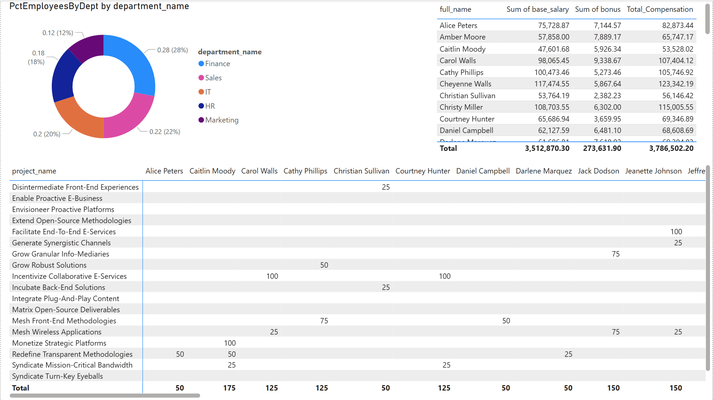

## 🧠 Financial Analytics with Power BI

This dashboard project simulates an internal finance analytics tool for a mid-sized business, using real-world KPIs, project allocations, and workforce cost tracking.

### Key Dashboards

#### 📊 Department Performance
- Monthly revenue, profit, and margin analysis
- DAX measures for YTD and custom KPIs

#### 👥 Workforce & Salaries
- Allocation of employees to projects
- Salary and bonus breakdown by department

## Workforce Allocation Report

This report visualizes the distribution of employees across departments, salary details, and project allocations.

*Figure: Workforce Allocation dashboard showing employee percentage by department, salary breakdowns, and project assignments.*

#### 📈 Efficiency Metrics
- Cost-to-revenue ratios
- Departmental profit rankings

### Tools & Techniques

- **Power BI Desktop**
- **DAX**: `YTD_Revenue`, `Cost_Revenue_Ratio`, `RankX`, `Margin_Pct`
- **Power Query**
- SQLite-generated data via Python & Faker

> 🔎 Ask for a PDF export, screenshots, or live walkthrough.
