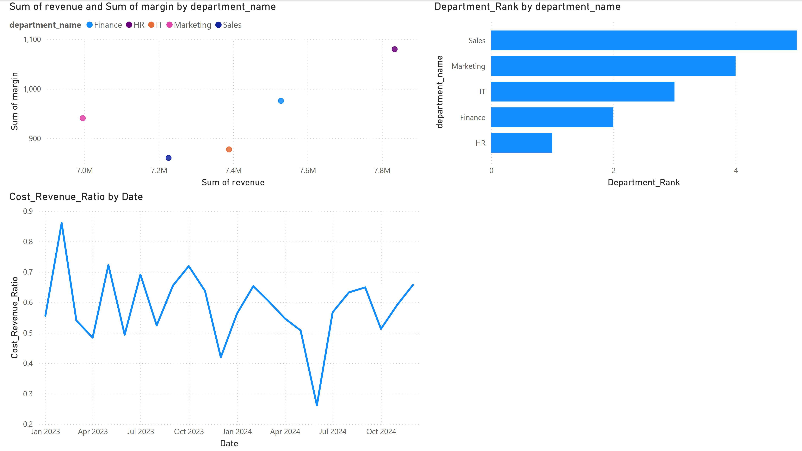

## 🧠 Financial Analytics with Power BI

This dashboard project simulates an internal finance analytics tool for a mid-sized business, using real-world KPIs, project allocations, and workforce cost tracking.

### Key Dashboards

#### 📊 Department Performance
- Monthly revenue, profit, and margin analysis
- DAX measures for YTD and custom KPIs
## Department Financial Performance

This dashboard visualizes key financial metrics across departments, with a focus on revenue, expenses, profit, and margin trends. It reflects real responsibilities like financial reporting, margin review, and profitability analysis.

*Figure: Power BI dashboard showing revenue, expenses, profit, and margin trends over time.*

### Key Visuals
- **Bar chart** of Revenue, Expenses, Profit by Department.
- **Line chart** showing monthly Profit and Margin % trends (dual-axis).
- **KPI Cards** for Year-to-Date (YTD) Revenue and Margin.

Show DAX Code

<pre><code class="language-dax">
YTD_Revenue = 
TOTALYTD(
    SUM(financials[revenue]), 
    'Date'[Date]
)

Margin_Pct = 
DIVIDE(
    SUM(financials[profit]), 
    SUM(financials[revenue])
) * 100
</code></pre>

#### 👥 Workforce & Salaries
- Allocation of employees to projects
- Salary and bonus breakdown by department
## DAX Examples for Workforce Allocation Report

Show DAX Code

<pre><code class="language-dax">
PctEmployeesByDept = 
DIVIDE(
    COUNTROWS(employees),
    CALCULATE(COUNTROWS(employees), ALL(employees))
)

TotalComp = employees[base_salary] + employees[bonus]
</code></pre>

## Workforce Allocation Report

This report visualizes the distribution of employees across departments, salary details, and project allocations.

*Figure: Workforce Allocation dashboard showing employee percentage by department, salary breakdowns, and project assignments.*

#### 📈 Efficiency Metrics
- Cost-to-revenue ratios
- Departmental profit rankings

A dashboard focused on operational performance, benchmarking, and analytical KPIs.

🔍 Visuals:
Scatter plot: Revenue vs. Margin % by department

Rank chart: Departments ranked by total profit

Trend line chart: Cost-to-revenue ratio over time

 
<strong>🔧 DAX Measures Used</strong>
 
Cost_Revenue_Ratio
Cost_Revenue_Ratio = DIVIDE(SUM(financials[expenses]), SUM(financials[revenue]))

Total_Profit
Total_Profit = SUM(financials[profit])

Department_Rank
Department_Rank = RANKX(ALL(departments), [Total_Profit], , DESC)

### Tools & Techniques

- **Power BI Desktop**
- **DAX**
- **Power Query**
- SQLite-generated data via Python & Faker
